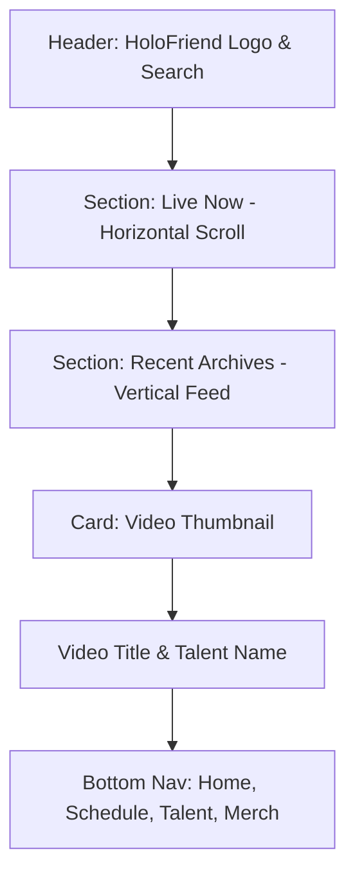
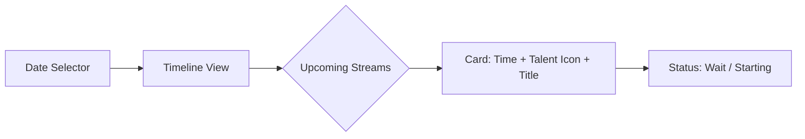
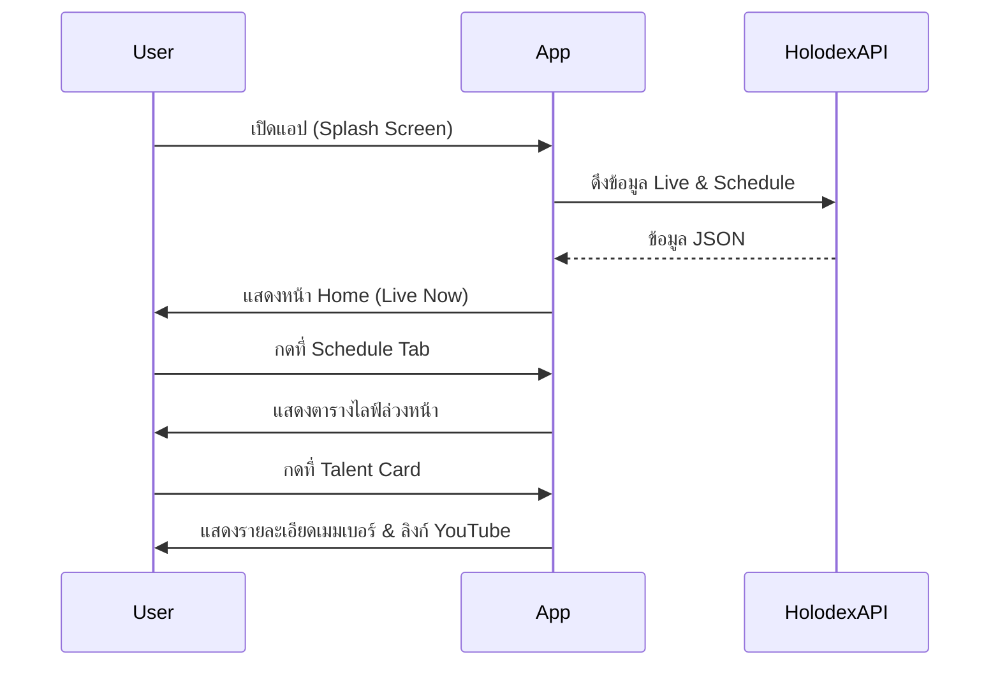
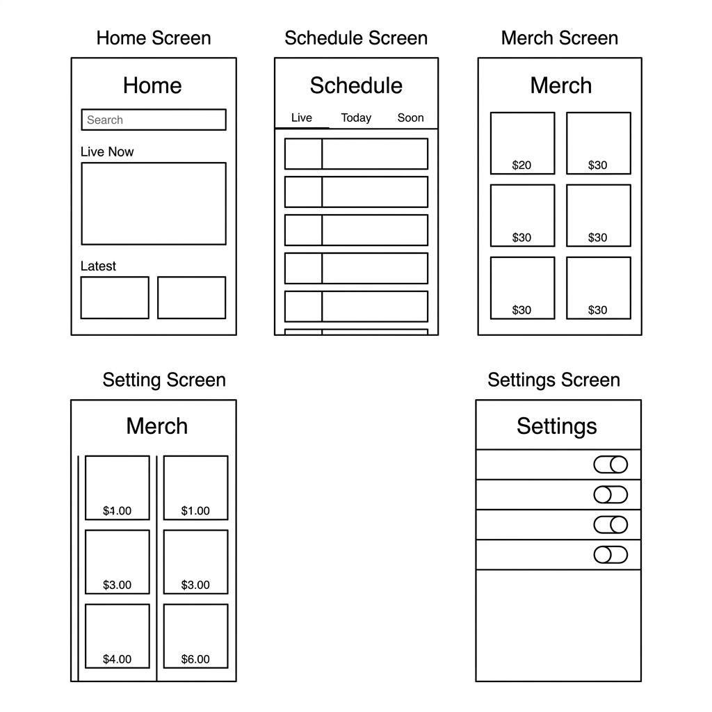
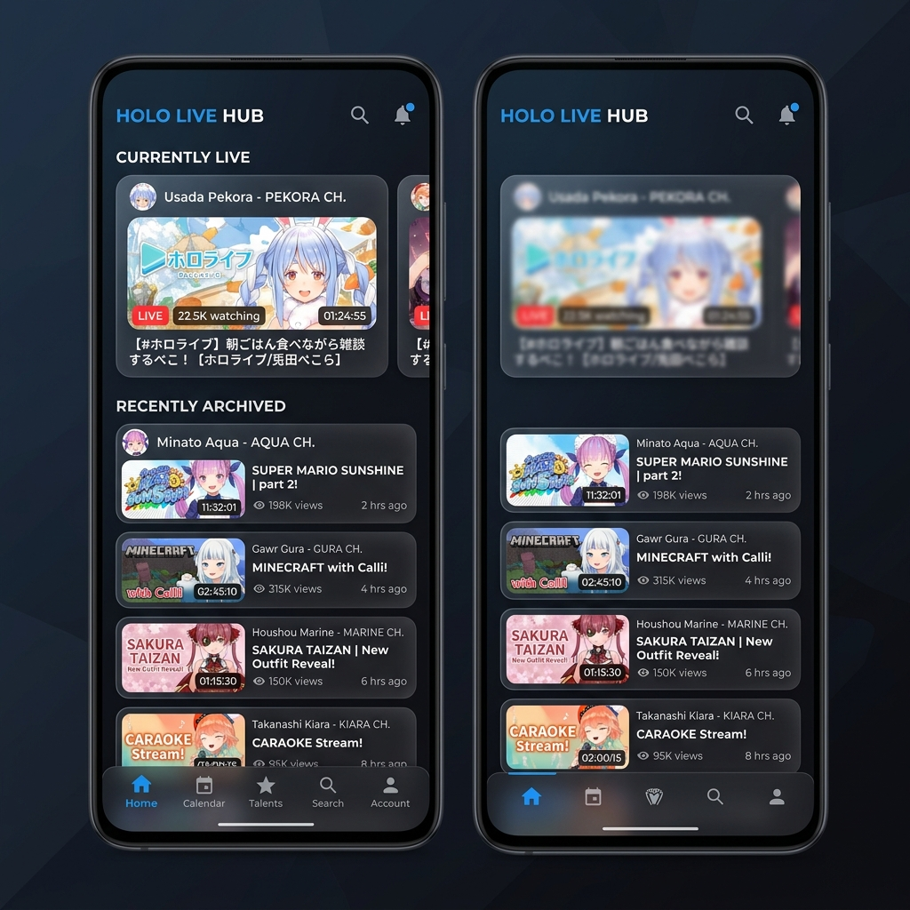

# 📄 Project Report & Wireframes: HoloFriend 💙

รายงานสรุปโครงสร้างและระบบการทำงานของแอปพลิเคชัน **HoloFriend** เพื่อใช้เป็นแนวทางในการพัฒนาและออกแบบประสบการณ์ผู้ใช้ (UX/UI)

---

## 1. Project Overview (ภาพรวมโครงการ)

**HoloFriend** คือแอปพลิเคชัน Android ที่ออกแบบมาเพื่อเป็นศูนย์กลางสำหรับแฟนคลับ Hololive โดยเฉพาะ โดยเน้นที่ความรวดเร็ว แม่นยำ และดีไซน์ที่พรีเมียม

### Key Objectives:
- **Accuracy**: กรองเฉพาะคอนเทนต์ทางการ (Official) 100%
- **Engagement**: แสดงตารางไลฟ์ที่กำลังจะมาถึงแบบ Real-time
- **Accessibility**: เข้าถึงร้านค้าและการระบุรุ่น (Generations) ของเมมเบอร์ได้ง่าย

---

## 2. Wireframe Structures (โครงร่าง UI)

เราใช้ระบบนำทางแบบ **Bottom Navigation** เพื่อให้ผู้ใช้สลับหน้าหลักได้สะดวกที่สุด

### A. Home Screen (หน้าหลัก)
เน้นการแสดงผลไลฟ์ที่กำลังเกิดขึ้น (Live Now) และวิดีโอล่าสุด

### B. Schedule Screen (ตารางไลฟ์)
ตารางเวลาที่ชัดเจน แบ่งตามช่วงเวลา (Morning, Afternoon, Evening)

---

## 3. User Flow (ลำดับการใช้งาน)

---

## 4. UI Mockup & Wireframe Concept

นี่คือภาพร่าง **Wireframe** พื้นฐานและภาพจำลองหน้าจอหลัก (**Home Screen**)

### Basic Wireframe

### Visual Mockup

---

## 5. Design Guidelines (หลักการออกแบบ)

- **Typography**: ใช้ฟอนต์ 'Inter' หรือ 'Roboto'
- **Colors**:
    - Primary: `#2196F3` (Hololive Blue)
    - Background: `#0F172A` (Dark Navy)
- **Components**: ใช้ขอบมน (Rounded Corners 16dp) และ Glassmorphism

---
*จัดทำโดย Antigravity AI*
